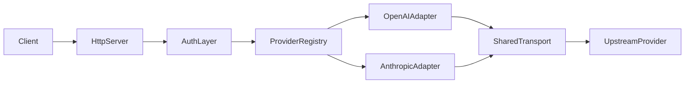

# LLM Proxy Design

## Goal

实现一个低延迟、高吞吐的 Go 代理服务，把客户端请求按配置转发到多个 LLM 上游，同时让客户端只接触代理自己的 token。

## Key Constraints

- provider 通过配置文件定义
- provider 类型只分 `openai` 与 `anthropic`
- GLM 这类 OpenAI 兼容上游通过 `type: openai` 接入
- 上游 token 仅保存在服务端配置
- stream 必须尽量直通，避免额外缓冲和事件重组

## Architecture

## Request Flow

1. 客户端请求进入 `net/http` 服务。
2. 鉴权层从 `Authorization` 或 `x-api-key` 提取代理 token。
3. 路由层根据 `base_path` 选中 provider。
4. 根据 provider `type` 注入对应的上游鉴权头。
5. 共享 `http.Transport` 负责连接复用和上游请求。
6. 响应体原样回传；如果是 SSE，则按写入节奏持续 `Flush`。

## Performance Notes

- 不解析请求 JSON，避免 decode/re-encode
- 不做统一中间模型转换
- 用共享 `http.Transport` 做 keep-alive 和连接池
- stream 只做 header 透传与写回，不做事件级转换
- 默认日志只保留请求路径、状态码和耗时

## Operational Endpoints

- `GET /healthz`
- `GET /metrics`

`/metrics` 当前提供一个零依赖 JSON 统计视图，用于快速观察请求总数和状态码分布。
